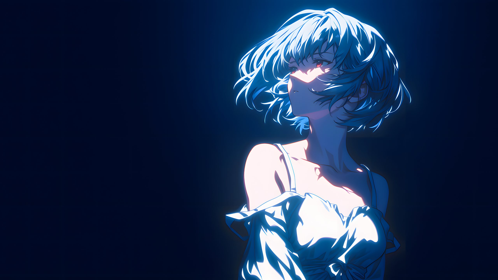

# mini-term 皮肤库

这里是**成品皮肤**，下载即装，不用改一个字。

> 你多半是从 **设置 → 外观 → 主题与语言 → 外置皮肤 → 「更多皮肤」** 跳过来的。挑一份下载，回应用里导入即可。
> 想**自己做**一份皮肤，字段说明在 [`docs/theme-pack-example/`](../docs/theme-pack-example/)（那边是模板，这边是成品）。

---

## Blue Hour 蓝调时分



深紫蓝底 + 冷蓝人像氛围图 + 余烬橙 accent，暗色皮肤。终端与面板半透明压在氛围层上。

**📦 [下载 blue-hour.zip](https://github.com/dreamlonglll/mini-term/raw/main/theme/blue-hour.zip)（211 KB）** · [看包内文件](blue-hour/)

---

## 怎么装

### 最快：下 zip → 「导入 zip」

1. 点上面的 **下载 blue-hour.zip**（浏览器直接开始下载）；
2. 回到 mini-term：设置 → 外观 → 主题与语言 → 外置皮肤 → **「导入 zip」**，选中刚下的文件；
3. 列表里出现卡片，点一下就应用了。

### 或者：拿到文件夹 → 「添加皮肤」

GitHub 网页没法单独下载一个子目录，所以走文件夹得先把仓库弄到本地 —— 整仓 **Download ZIP**，或者：

```bash
git clone --depth 1 https://github.com/dreamlonglll/mini-term.git
```

然后 **「添加皮肤」** 选中 `theme/blue-hour/` 那个文件夹（里面得有 `theme.json`）。

### 或者：直接丢进皮肤目录

把皮肤文件夹整个拷进皮肤目录，回界面点「刷新」。目录位置见 **「打开皮肤目录」** 按钮，Windows 上是：

```
%APPDATA%\com.mini-term.app\themes\
```

> ⚠️ **皮肤 id = 文件夹名**，不是 `theme.json` 里的 `id` 字段 —— 两者不一致时一律以文件夹名为准。
> 装之前给文件夹改名，等于改了这份皮肤的 id；已经装过同名皮肤的话会被顶掉。

## 装完想调

`blue-hour` 带背景图，所以终端和面板会**半透明地压在氛围图上**。嫌太透或太暗，直接改皮肤目录里的 `theme.json` —— **保存即热重载**（目录监听 300ms 防抖），不用重启：

| 想改什么 | 改哪个 |
|---|---|
| 终端透明度 | `effects.terminalOpacity`（0–1，越小越透） |
| 侧栏 / 面板透明度 | `effects.surfaceOpacity` |
| 背景图压暗程度 | `effects.backgroundDim`（越大越暗） |
| 人物在视口里的位置 | `art.focusX` / `art.focusY`（0–1） |
| 配色 | `colors` 十个语义色、`terminal` 的 ANSI 配色 |

字段的完整含义见 [`docs/theme-pack-example/README.md`](../docs/theme-pack-example/README.md)。

---

## 几件值得知道的事

**包里没有 `theme.css`，这是故意的。** `theme.css` 与 `tokens` 是 Tauri + WebView 时代的机制，靠浏览器 CSS 引擎生效。GPUI 原生版没有 CSS 引擎，这两项**已无任何消费方** —— 写了不报错，但一行也不会生效。现在真正生效的是 `theme.json` 里的 `colors` / `appearance` / `image` / `art` / `effects` / `terminal`。

**`manifest.json` 只登记背景图。** 有 manifest 时导入会逐文件核对 `bytes` + `sha256`，防包在下载途中损坏。这里只登记二进制的背景图：`theme.json` 是文本，Git 在签出时可能按平台改写换行（`core.autocrlf`），字节数与哈希会跟着变，登记进去反而会让下载者撞上「大小不符」；文本损坏本来也会在 JSON 解析阶段直接报错。

**zip 与文件夹是同一份东西。** 两者的 `theme.json` 与背景图逐字节对齐，有测试钉着，不会漂开 —— 走哪条路装都一样。

**背景图。** `blue-hour/background.jpg` 是 2560×1440 / JPEG q85（231 KB），由 3840×2160 的 PNG 原图压制：背景要被 `backgroundDim` 压暗、还要被面板盖掉大半，原图那 6.9 MB 进 Git 不划算，观感上分辨不出差别。这张图随皮肤一起分发，**出处尚未注明** —— 仓库以 MIT 发布，但 MIT 覆盖的是代码，图片素材需要单独说明来源与许可。在补上之前，请勿把它当作可自由再分发的素材；如果你是版权方，欢迎开 issue 告知。
